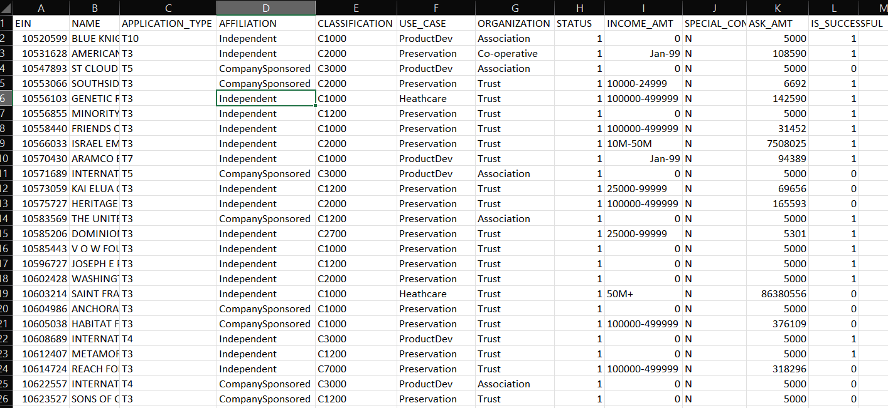

# Overview
The purpose of this analysis is to build a deep learning model that is capable of categorizing a record of data into one of two classes: successful or not successful, with an accuracy of at least 75%. 

# Results
## Data Preprocessing
<!-- What variable(s) are the targets for your model? -->
The `IS_SUCCESSFUL` variable is the target for our model. 
<!-- What variable(s) are the features for your model? -->
The features of our model are `APPLICATION_TYPE`	`AFFILIATION`, `CLASSIFICATION`, `USE_CASE`, `ORGANIZATION`, `STATUS`, `INCOME_AMT`	`SPECIAL_CONSIDERATIONS`, and `ASK_AMT`. 



Although, we dropped the columns `AFFILIATION`, `USE_CASE`, and `SPECIAL_CONSIDERATIONS` in a later attempt to improve the accuracy of our model. 

<!-- What variable(s) should be removed from the input data because they are neither targets nor features? -->
The variables `EIN` and `NAME` should be removed from the input data because they are neither targets nor features. 
## Compiling, Training and Evaluating the Model
<!-- How many neurons, layers, and activation functions did you select for your neural network model, and why? -->
We selected 100 neurons for the first hidden layer, 80 neurons for the second hidden layer, 100 neurons for the third hidden layer, and 80 neurons for the fourth hidden layer. We used the `tanh` function for each layer. We only used 4 hidden layers because most models should only require 3-4 hidden layers. Our selection of neurons and hidden layers prevents our model from using too many computational resources. 

<!-- Were you able to achieve the target model performance? -->
We were only able to achieve a model performance of 73.13% accuracy, which is only about 1% better than the original accuracy. 
```
268/268 - 1s - loss: 0.5568 - accuracy: 0.7313 - 585ms/epoch - 2ms/step
Loss: 0.5568366646766663, Accuracy: 0.7313119769096375
```
In any case, including when we used auto-optimization, we had a high amount of loss, which indicates that the model can be further improved. 

<!-- What steps did you take in your attempts to increase model performance? -->
To increase model performance, we added a few more hidden layers and increased the number of neurons in each layer, changed the activation functions of each layer, and removed more columns from the original data set. 

# Summary
<!-- Summarize the overall results of the deep learning model. Include a recommendation for how a different model could solve this classification problem, and then explain your recommendation. -->
The overall results of our deep learning model were a high amount of loss--55.80%---and an accuracy of 73.13%, which is better than the accuracy in our initial attempt (72.05%) but still falls short of our goal of an accuracy greater than 75%. 